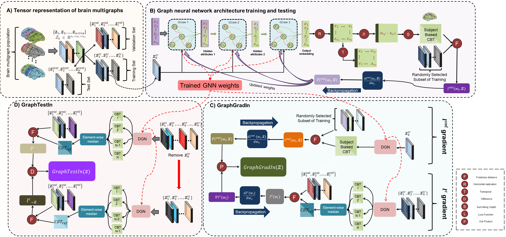
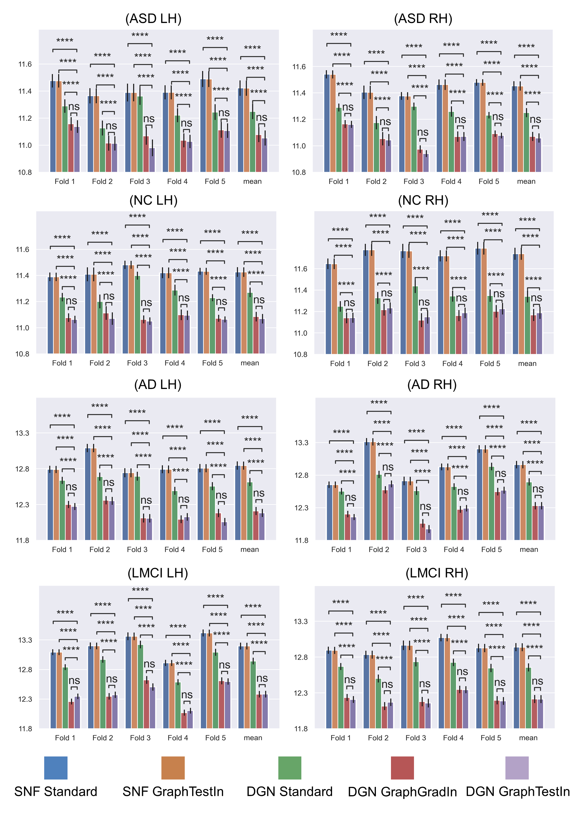

# GNN based Unsupervised Influential Sample Selection
How to quantify the influence of training multigraph on Graph Neural Network based multigraph population fusion task?



This repository provides the official PyTorch implementation of the following paper:

> **Graph Neural Network based Unsupervised Influential Sample Selection for Brain Multigraph Population Fusion**
>
> Mert Can Kurucu and Islem Rekik
>
> BASIRA Lab, Imperial-X Translation and Innovation Hub, Imperial College London, London, UK 
> 
> Istanbul Technical University, Istanbul, Turkey
> 
> **Abstract:**  *Graph neural networks (GNNs) have witnessed remarkable proliferation due to the increasing number of applications where data are represented as 
>graphs. Recently, using GNN-based multigraph population fusion methods for estimating population representative connectional brain templates (CBT) has led to 
>improvements, especially in network neuroscience. However, prior studies do not consider how an individual training brain multigraph influences the quality of GNN 
>training for brain multigraph population fusion. To address this issue, we propose two major sample selection methods to quantify the *influence* of a 
>training brain multigraph on the brain multigraph population fusion task using GNN, in *a fully unsupervised manner*: (1) *GraphGradIn*, in which we 
>use gradients w.r.t GNN weights to trace changes in centeredness loss of connectional brain template during the *training phase*; (2) *GraphTestIn*, 
>in which we exclude a training brain multigraph of interest during the refinement process in the *test phase* to infer its influence on the CBT centeredness 
>loss. Next, we select the most influential multigraphs to build the training set for brain multigraph population fusion. We conducted extensive experiments on 
>brain multigraph datasets to show that using an influential training dataset improves the learned connectional brain template in terms of centeredness, 
>discriminativeness and topological soundness. Finally, we demonstrate the use of our methods by discovering the connectional fingerprints of healthy and 
>neurologically disordered brain multigraph populations including Alzheimer’s disease and Autism spectrum disorder patients.*

Please contact mertcan.kurucu@gmail.com for inquiries. Thanks.

## Dependencies

 - [Python 3.8+](https://www.python.org/downloads/release/python-380/)
 - [numpy](https://numpy.org/)
 - [scikit-learn](https://scikit-learn.org/stable/)
 - [PyTorch](https://pytorch.org/)
 - [PyTorch Geometric](https://pytorch-geometric.readthedocs.io/en/latest/notes/installation.html)
  
## Installation

Copy and paste following commands to install all packages (CPU version)

```sh
$ pip install -r requirements.txt
```

If you want to install manually copy and paste the following commands

```sh
$ pip install numpy
$ pip install -U scikit-learn
$ pip3 install torch torchvision torchaudio
$ pip install torch_geometric
```

This is all for CPU installation, **we strongly recommend you to use GPU version.** Please visit (optional) PyTorch Geometric’s web page (https://pytorch-geometric.readthedocs.io/en/latest/notes/installation.html) for description on installing GPU version. Code will check the version of dependencies and availability of GPU. If everything is configured correctly, it will utilize GPU automatically.

## Data format and simulated data

This code is provided with a simulated multigraph dataset for GNN-based multigraph population fusion. In case you want to use GraphGradIn and GraphTestIn on your graph dataset, we represent each multigraph with stacked symmetrical connectivity matrices. Therefore our model expects you to provide a path of numpy array saved as a binary file in NumPy .npy format with shape [#Subjects, #Nodes, #Nodes, #Views]. For our case network nodes were regions of interest in the brain, however, any type of node is a valid input. If your networks are single view, you can simply set #Views to 1.

## Runing the code

To run our code, open up a terminal at folder’s directory and type in

```sh
$ python main.py --GraphGradIn
```
or
```sh
$ python main.py --GraphTestIn
```

##### You may edit config.py to tune hyperparameters, configure training or supply your own dataset.

## Components of the code
| Component | Content |
| ------ | ------ |
| config.py | Includes hyperparameter and other options. You may modify it according to your needs. |
| model.py | Implementation of the graph neural network model. |
| main.py| Driver code that import variables from config.py, calculates influence scores and train the GNN with multigraphs with highest influence scores.  |
| GraphGradIn.py| Code for GraphGradIn influence score calculation method.  |
| GraphTestIn.py| Code for GraphTestIn influence score calculation method.  |
| helper.py| Includes some helper functions |
| output/<model name>/ | After the training, this directory includes model parameters, final connectional template, and subject biased templates for each fold. |
| temp/ | Includes interim model parameters that are saved. Deleted after the training.  |
#####  output/<model name>/ and temp/ directories created by main.py
  
## Example Result  

Centeredness comparison of CBTs generated by SNF, SNF GraphTestIn, DGN, DGN GraphGradIn and DGN GraphTestIn. Charts illustrate the mean Frobenius distance between the connectional brain templates estimated using the training sets and networks of the samples in the test set using a 5-fold cross-validation strategy. We report the average distance for each cross validation fold as well as the average across folds (“Mean” bars on the right). DGN GraphGradIn and DGN GraphTestIn outperforms standard DGN and also SNF with a high statistical significance demonstrated by a Welch’s t-test (all p < 1e-04). Also using GraphTestIn for SNF has improved compared to standard SNF by a small amount, but with a significant statistical significance. (p < 1e-04). The difference between DGN GraphGradIn and DGN GraphTestIn is not statistically significant (p > 0.05). LH: left hemisphere. RH: right hemisphere.

## Relevant References
Fey, M. & Lenssen, J. E. Fast graph representation learning with PyTorch Geometric. In ICLR Workshop on Representation Learning on Graphs and Manifolds (2019).

Adam Paszke, Sam Gross, Soumith Chintala, Gregory Chanan, Edward Yang, Zachary DeVito, Zeming Lin, Alban Desmaison, Luca Antiga, and Adam Lerer. Automatic differentiation in pytorch. In NIPS-W, 2017.

## Please cite the following paper when using our method
```latex
@article{kurucu2023,
 title = {Graph Neural Network based Unsupervised Influential Sample Selection for Brain Multigraph Population Fusion},
 journal = {Computerized Medical Imaging and Graphics},
 year = {2023},
 author = {Kurucu, Mert Can and Rekik, Islem},
}
```
